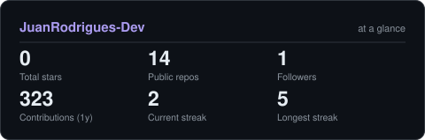

<!-- BANNER - terminal profile.sh --live -->
<picture>
  <source media="(prefers-color-scheme: dark)"  srcset="assets/banner-dark.v9.svg">
  <source media="(prefers-color-scheme: light)" srcset="assets/banner-light.v9.svg">
  
</picture>

 

<!-- NOME / TAGLINE - digitação animada -->

 

<!-- REDES SOCIAIS -->
&nbsp;&nbsp;

 

---

## Olá, mundo! 👋

Sou o **Juan Rodrigues Gomes**, estudante de **Análise e Desenvolvimento de Sistemas no IFPB Campus Cajazeiras**, apaixonado por tecnologia, desenvolvimento de software e resolução de problemas por meio de código. 

- 💻 **Foco atual:** Desenvolvimento Full-Stack com JavaScript, TypeScript, React, Next.js, Node.js e Java (Spring Boot).
- 🗄️ **Banco de Dados:** Modelagem relacional e otimização de consultas SQL (PostgreSQL e MySQL).
- ☁️ **Cloud & DevOps:** Estudos contínuos em arquitetura Cloud na AWS Academy e conteinerização com Docker.
- 🌱 **Missão:** Evoluir constantemente como desenvolvedor, criando aplicações eficientes e focando em soluções escaláveis.

 

## Minha Stack Tecnológica

---

## Sinais & Habilidades

<table>
<tr>
<td width="50%" align="center" valign="middle">

<picture>
  <source media="(prefers-color-scheme: dark)"  srcset="assets/radar-dark.svg">
  <source media="(prefers-color-scheme: light)" srcset="assets/radar-light.svg">
  
</picture>

</td>
<td width="50%" align="center" valign="middle">

<picture>
  <source media="(prefers-color-scheme: dark)"  srcset="assets/radar-langs-dark.svg">
  <source media="(prefers-color-scheme: light)" srcset="assets/radar-langs-light.svg">
  
</picture>

</td>
</tr>
</table>

---

## Estatísticas

<picture>
  <source media="(prefers-color-scheme: dark)"  srcset="assets/card-stats-dark.svg">
  <source media="(prefers-color-scheme: light)" srcset="assets/card-stats-light.svg">
  
</picture>

 

---

` Feito com dedicação · Juan Rodrigues Gomes `

